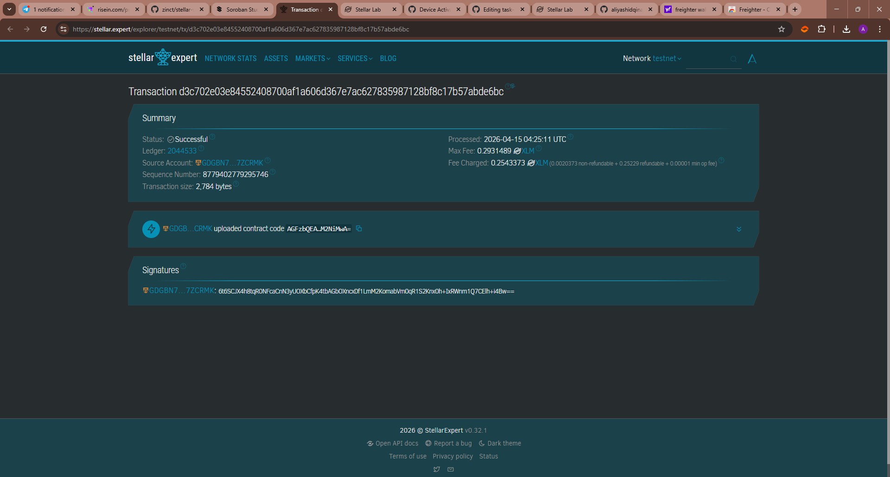

# Stellar Task Manager DApp

**Stellar Task Manager DApp** - Blockchain-Based Decentralized Task Management System

## Project Description

Stellar Task Manager DApp is a decentralized smart contract application built on the Stellar blockchain using Soroban SDK. It provides a secure and transparent platform for managing daily tasks directly on-chain without relying on centralized systems.

This application allows users to create, view, complete, and delete tasks. Each task is uniquely identified and stored in the smart contract’s storage, ensuring data persistence, transparency, and reliability across the network.

By leveraging blockchain technology, this system guarantees that all task data is tamper-proof and accessible in a trustless environment.

## Project Vision

Our vision is to transform task management systems by:

- **Decentralizing Productivity**: Moving task management from centralized apps to blockchain-based systems  
- **Ensuring Data Ownership**: Giving users full control over their tasks and productivity data  
- **Enhancing Transparency**: Making all task operations verifiable on-chain  
- **Improving Security**: Protecting user data using blockchain technology  
- **Building Trustless Systems**: Eliminating dependency on third-party services  

We aim to create a future where productivity tools are secure, decentralized, and fully owned by users.

## Key Features

### 1. **Task Creation**

- Easily add new tasks with a title  
- Automatic unique ID generation  
- Tasks are stored permanently on the blockchain  

### 2. **Task Retrieval**

- View all tasks in one request  
- Structured data for easy frontend integration  
- Real-time synchronization with blockchain data  

### 3. **Task Completion**

- Mark tasks as completed  
- Update task status directly on-chain  
- Track productivity progress  

### 4. **Task Deletion**

- Delete tasks using their unique ID  
- Efficient storage management  
- Immediate update after deletion  

### 5. **Transparency and Security**

- All actions are recorded on blockchain  
- Immutable and tamper-proof data  
- Secure and verifiable operations  

### 6. **Stellar Network Integration**

- Fast and low-cost transactions  
- Built using Soroban Smart Contract SDK  
- Scalable and efficient architecture  

## Contract Details

- Contract Address: CC4J57J4NCIT5ZYB36ARJD6NNKXI2634JPVLKE7N6MQ6GM56ZGLLGCO7CC4J57J4NCIT5ZYB36ARJD6NNKXI2634JPVLKE7N6MQ6GM56ZGLLGCO7
  

## Future Scope

### Short-Term Enhancements

1. **Task Categories**: Add labels or categories for better organization  
2. **Due Dates**: Add deadlines for each task  
3. **Priority Levels**: Set priority (Low, Medium, High)  
4. **Search & Filter**: Find tasks easily  

### Medium-Term Development

5. **Collaboration Features**: Share tasks with multiple users  
6. **Notification System**: Alerts for deadlines or updates  
7. **Task History**: Track changes and completion logs  
8. **Integration**: Connect with other smart contracts  

### Long-Term Vision

9. **Cross-Chain Support**: Expand to other blockchain networks  
10. **Decentralized Frontend**: Host UI on IPFS  
11. **AI Productivity Assistant**: Smart task suggestions  
12. **Privacy Enhancements**: Advanced data protection  
13. **DAO Governance**: Community-driven improvements  
14. **Decentralized Identity**: User identity integration  

### Enterprise Features

15. **Team Task Management**: Support for organizations  
16. **Audit Logs**: Immutable activity tracking  
17. **Automated Workflows**: Smart triggers for tasks  
18. **Multi-Language Support**: Global accessibility  

---

## Technical Requirements

- Soroban SDK  
- Rust programming language  
- Stellar blockchain network  

## Getting Started

Deploy the smart contract to Stellar Soroban network and use the following functions:

- `add_task()` - Create a new task  
- `get_tasks()` - Retrieve all tasks  
- `complete_task()` - Mark a task as completed  
- `delete_task()` - Delete a task by ID  

---

**Stellar Task Manager DApp** - Managing Your Tasks Securely on the Blockchain 🚀